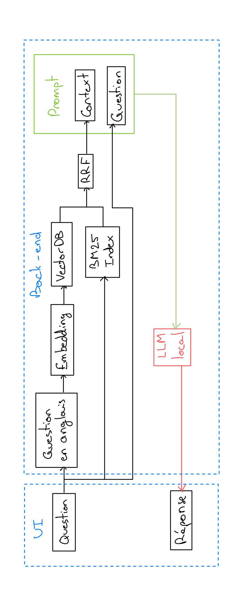
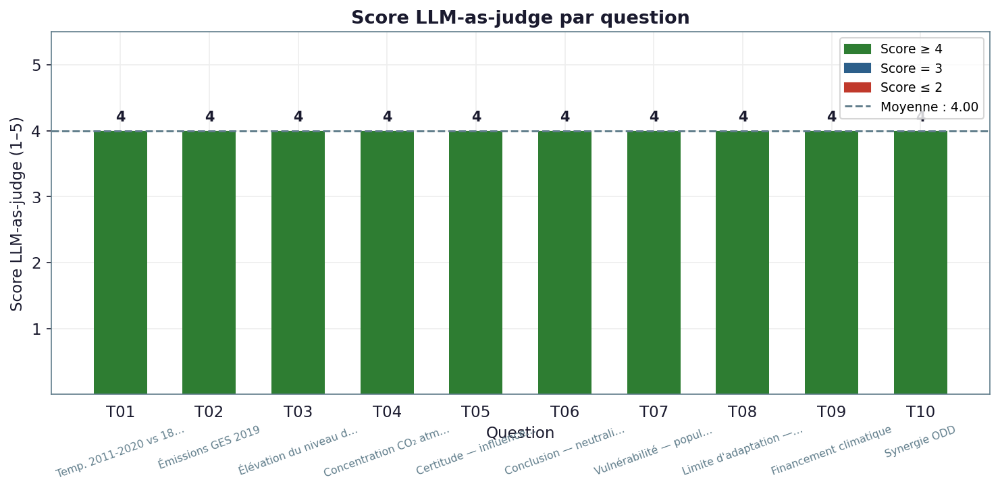
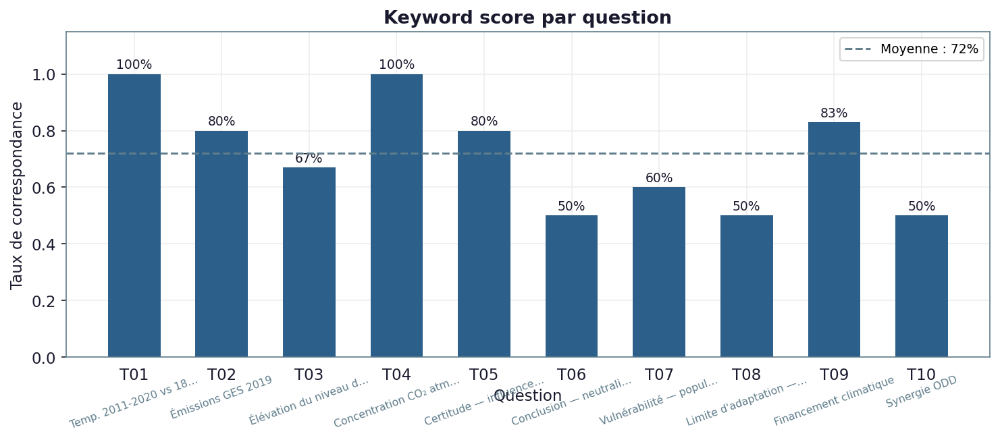
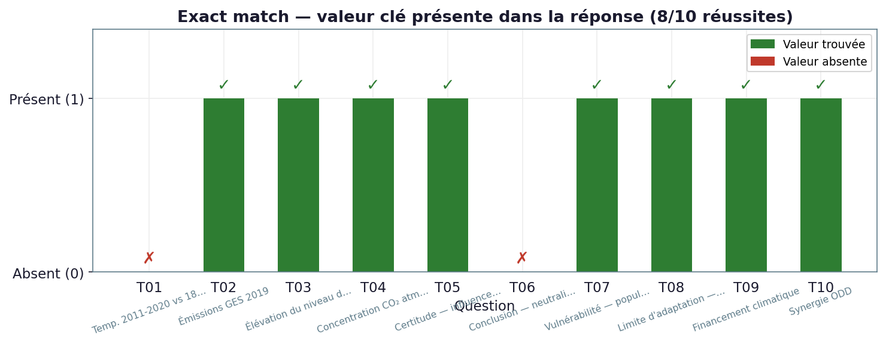

# IPCC AR6 Local Chatbot

Ce projet implémente un système RAG (Retrieval-Augmented Generation) destiné à interroger localement le rapport de synthèse 2023 du GIEC (AR6 SYR). L'objectif est de produire des réponses en français précises, sourcées et cohérentes avec le rapport, tout en limitant les hallucinations du modèle.

## 1. Présentation

Un RAG (Retrieval-Augmented Generation) combine la recherche d'information et la génération de texte. Plutôt que de s'appuyer uniquement sur la mémoire du modèle, le système trouve d'abord des passages pertinents dans le corpus AR6, puis demande au LLM de formuler la réponse à partir de ces passages. Cette architecture est particulièrement adaptée aux données sensibles et volumineuses, car elle favorise la souveraineté locale et réduit les risques d'hallucinations en limitant la génération aux extraits récupérés.

La motivation du projet est double : exploiter des IA locales de plus en plus efficientes, et garantir une couche de souveraineté et de traçabilité pour un document scientifique sensible.

Le système combine :
- une indexation vectorielle du corpus PDF,
- une recherche hybride (dense + lexicale),
- un LLM local exécuté via Ollama.

Le pipeline principal couvre :
1. traduction de la question française vers l'anglais,
2. récupération du contexte le plus pertinent dans le corpus,
3. génération d'une réponse basée uniquement sur ce contexte,
4. citation des sources et respect de la terminologie GIEC.

### Exemples de questions et de réponses


## 2. Méthode du projet

### 2.1. Ingestion et indexation

- Le rapport AR6 est découpé en fragments textuels.
- Chaque fragment est converti en vecteur d'embedding.
- Les vecteurs sont stockés dans une base de données ChromaDB locale.

### 2.2. Recherche hybride

- Une recherche dense sur embeddings est couplée à une recherche lexicale.
- La requête utilisateur est traduite par un prompt dédié pour maximiser la correspondance avec le vocabulaire du GIEC.
- Les extraits [SPM] (Résumé pour décideurs) sont priorisés lorsque disponibles.



### 2.3. Génération contrôlée de la réponse

- Le modèle reçoit uniquement le contexte récupéré et la question originale.
- Le prompt impose des règles strictes :
  - répondre en français,
  - utiliser uniquement les passages fournis,
  - citer les sources pour les données chiffrées,
  - respecter la hiérarchie SPM > texte de corps,
  - si l'information n'est pas disponible, indiquer clairement l'impossibilité de répondre.

### 2.4. Validation et robustesse

- Chaque réponse est évaluée selon plusieurs métriques :
  - exact match des valeurs attendues,
  - score de mots-clés,
  - absence de valeurs erronées,
  - présence d'extraits SPM,
  - note attribuée par un LLM évaluateur.

## 3. Installation

### Pré-requis

- Python 3.10 ou supérieur.
- Environnement Python isolé (venv ou conda).
- Ollama installé localement avec le modèle `llama3.2` disponible.

### Installation des dépendances

```bash
python -m venv .venv
source .venv/bin/activate
pip install -r requirements.txt
```

ou avec conda :

```bash
conda create -n eco-rag python=3.11 -y
conda activate eco-rag
pip install -r requirements.txt
```

### Configuration Ollama

- Vérifiez qu'Ollama est installé et configuré.
- Assurez-vous que le modèle `llama3.2` est accessible.

## 4. Principales bibliothèques utilisées

- `langchain` : orchestration du pipeline RAG.
- `langchain-ollama` : intégration du LLM local Ollama.
- `langchain-chroma` : accès à la base vectorielle ChromaDB.
- `langchain-community` : fonctionnalités additionnelles LangChain.
- `langchain-text-splitters` : découpage de documents PDF en blocs.
- `pypdf` : extraction de texte depuis les PDF.
- `rank-bm25` : recherche lexicale hybride.
- `matplotlib` et `numpy` : production de graphiques et calcul de métriques.

## 5. Modèles LLM et embeddings

- LLM principal : `llama3.2` via `OllamaLLM` (https://ollama.com/library/llama3.2).
- Embeddings : `mxbai-embed-large` (https://ollama.com/library/mxbai-embed-large)
- Évaluateur : même modèle `llama3.2` utilisé pour noter les réponses.

## 6. Usage

### Exécution via Streamlit

```bash
streamlit run app.py
```

- Lancez l'interface web locale.
- Posez vos questions en français.
- Le système traduit la requête, récupère le contexte le plus pertinent et génère la réponse.

## 7. Évaluation

Le modèle est testé sur une série de 10 questions combinant données chiffrées et compréhension générales des travaux du GIEC.

### Résultats






